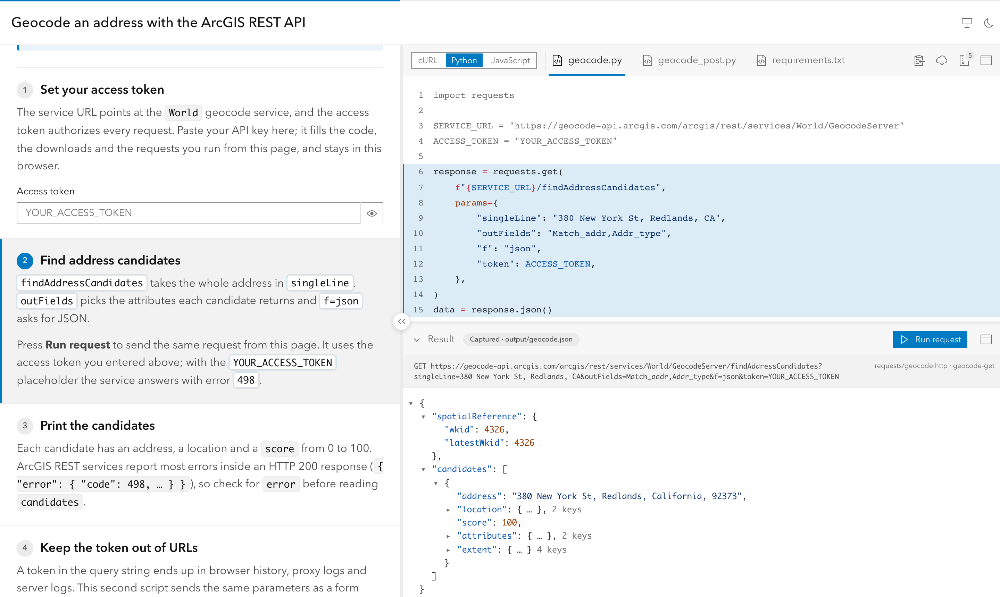
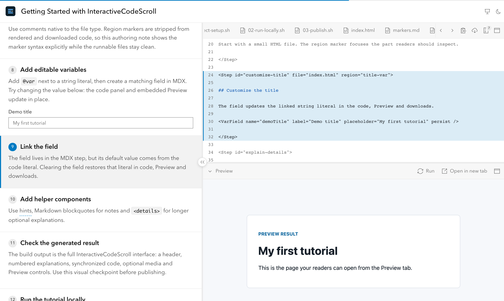

<div align="center">

# InteractiveCodeScroll

**Scroll-driven code tutorials that work on stage and at home.**

Write the story in MDX, keep your code runnable, and get a static site where explanations, highlighted code, live Preview and request results move together as readers scroll — or as you click through on stage.

[](https://www.npmjs.com/package/interactive-code-scroll)
[](https://github.com/hhkaos/interactive-code-scroll/actions/workflows/ci.yml)
[](LICENSE)
[](#-beta-and-evolving-fast)
[](https://astro.build)
[](https://github.com/hhkaos/interactive-code-scroll/stargazers)

[**Live demo**](https://www.rauljimenez.info/interactive-code-scroll/) · [Features](docs/features.md) · [Docs](docs/authoring.md) · [Examples](#examples) · [Report a bug / request a feature](https://github.com/hhkaos/interactive-code-scroll/issues/new/choose)

<picture>
  <source media="(prefers-color-scheme: dark)" srcset=".github/assets/hero-rest-python-dark.png">
  
</picture>

</div>

## Start in 30 seconds

```sh
npm create interactive-code-scroll@latest my-tutorial
cd my-tutorial
npm run dev
```

The wizard asks for one tutorial or a series, what each tutorial uses (web app, REST API, script, native app and their languages), your package manager and whether to add a GitHub Pages workflow. It writes a working example you can edit right away.

## Why

Tutorials split into dozens of code blocks are hard to follow. At conferences, speakers jump between slides and an IDE, and attendees go home without a way to replay the session. InteractiveCodeScroll gives you **one artifact** for both: projected in the talk, read at home, downloaded as a runnable project.

Built for people who teach developer technologies: developer advocates, trainers, technical writers and conference speakers.

## Features

| | |
|---|---|
| 🧭 **Scroll-synced steps** | Each step focuses a file, a code region or an image carousel. Deep links to any step. |
| 🎤 **Presentation mode** | Clean, projector-friendly layout. Keyboard and clicker (PageUp/PageDown) navigation. |
| 🌐 **Multi-language variants** | One tutorial, several languages (e.g. cURL / Python / JavaScript). Readers switch in place. |
| ▶️ **Live Preview** | Web code runs in an embedded Preview, with an "open in new tab" fallback. |
| 📡 **Request runner** | `.http` requests run from the page; captured output shows when there is no token. JSON viewer included. |
| ✏️ **Fields → code variables** | Readers type their own API key or title; code, Preview and downloads update. |
| 📦 **Copy & ZIP downloads** | Readers leave with a runnable project, markers stripped. |
| 📚 **Series sites** | Many tutorials in one site, with an index, tag filters and sibling tutorials across SDKs. |
| 🚀 **Static output** | Deploy anywhere. A GitHub Pages workflow is one wizard answer away. |
| 🌗 **Light and dark** | Follows the reader's system preference, with a toggle. |

See every capability in [docs/features.md](docs/features.md).

<picture>
  <source media="(prefers-color-scheme: dark)" srcset=".github/assets/getting-started-preview-dark.png">
  
</picture>

## How it works

Your code stays plain and runnable. Comments mark the regions a step focuses on and the values readers can edit:

```js
// #region config
const title = "My tutorial"; // @var title
// #endregion config
```

MDX steps point at files and regions:

```mdx
<Step id="configure" file="main.js" region="config">

## Configure the demo

<VarField name="title" label="Title" persist />

</Step>
```

Markers are stripped from rendered and downloaded code. Broken references fail the build with the file and line, so tutorials don't rot silently.

## Examples

- **[Getting started](examples/getting-started)** — learn the authoring flow in a tutorial built with InteractiveCodeScroll itself.
- **[Geocode an address with the ArcGIS REST API](examples/rest-geocode)** — cURL, Python and JavaScript variants, live requests, captured output and error explanations.
- **[OAuth PKCE with the ArcGIS Maps SDK for JavaScript](https://github.com/EsriDevEvents/security-and-authentication-for-custom-applications-dtseu-2026/tree/main/demos/arcgis-js-sdk-user-auth)** — user authentication with a live Preview.

Built a tutorial with it? [Add it to the showcase](https://github.com/hhkaos/interactive-code-scroll/issues/new/choose).

## Documentation

- [Features](docs/features.md) — everything the tool can do, in one page
- [Authoring and API reference](docs/authoring.md) — folder layout, frontmatter, components, code markers
- [CLI reference](docs/cli.md) — `create`, `dev`, `build`, `serve`, `doctor`
- [Deployment](docs/deployment.md) — GitHub Pages and other static hosts
- [Upgrade guide](docs/upgrade.md)

## 🧪 Beta, and evolving fast

InteractiveCodeScroll is in **beta**: it is used for real tutorials and talks, and authoring APIs may still change before 1.0 (the [upgrade guide](docs/upgrade.md) covers every breaking change).

The first beta was built in under a week, driven by the needs of real tutorials — and it can keep moving at that pace with yours. **Missing something? Found a bug? [Open an issue](https://github.com/hhkaos/interactive-code-scroll/issues/new/choose).** Ideas from people who teach are what shape the roadmap.

If it looks useful, a ⭐ helps others find it.

## Transparency

- **Built with AI coding agents.** Design decisions, reviews and releases are human-led; most of the code and docs were written with AI agents (Claude Code and Codex). The agent instructions are in the repo: [CLAUDE.md](CLAUDE.md), [AGENTS.md](AGENTS.md), and the specification in [docs/dev/SPEC.md](docs/dev/SPEC.md).
- **Inspired by** [Stripe's interactive quickstarts](https://docs.stripe.com/checkout/quickstart).
- **Stack:** [Astro](https://astro.build), MDX, [Shiki](https://shiki.style), [Calcite Design System](https://developers.arcgis.com/calcite-design-system/), Vitest and Playwright.
- **Not an official Esri product.** A personal open-source project by [@hhkaos](https://github.com/hhkaos). The core is topic-agnostic; ArcGIS appears only in example tutorials.

## Contributing

Bug reports, ideas, docs fixes and code are all welcome. Start with [CONTRIBUTING.md](CONTRIBUTING.md). Please follow the [Code of Conduct](CODE_OF_CONDUCT.md) and report vulnerabilities as described in [SECURITY.md](SECURITY.md).

## License

[Apache-2.0](LICENSE)
