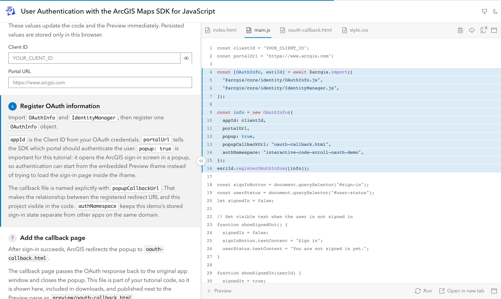
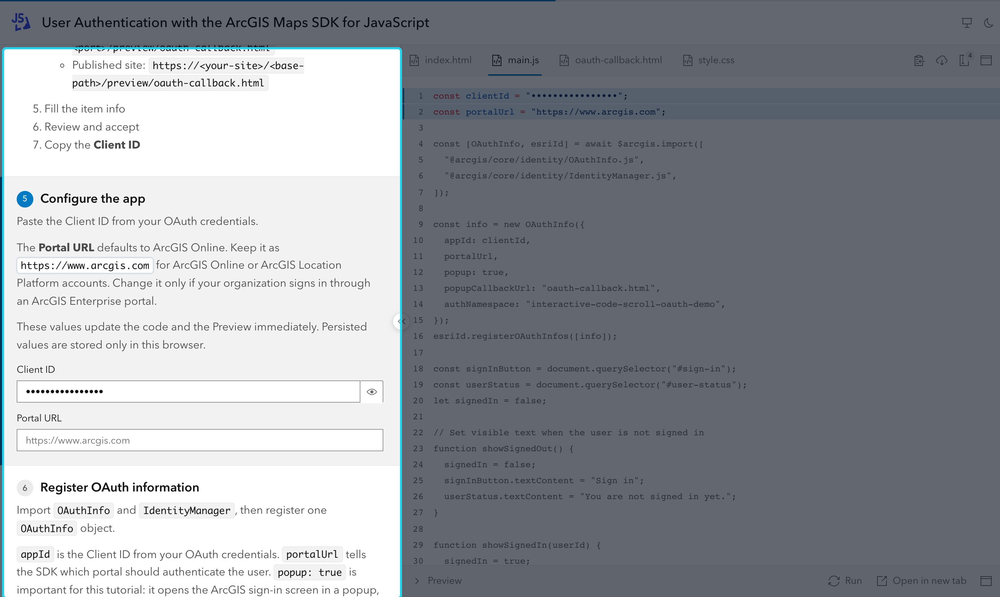
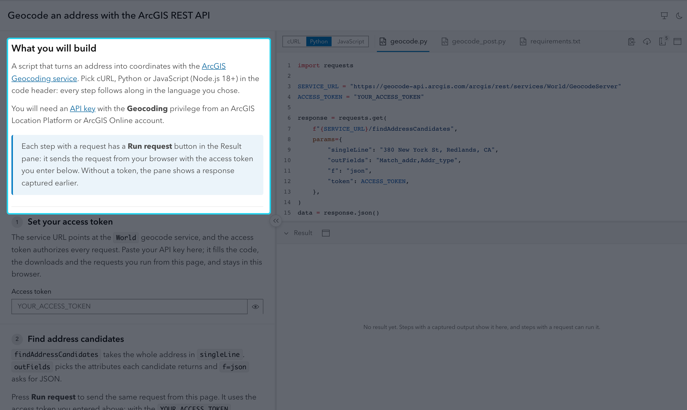
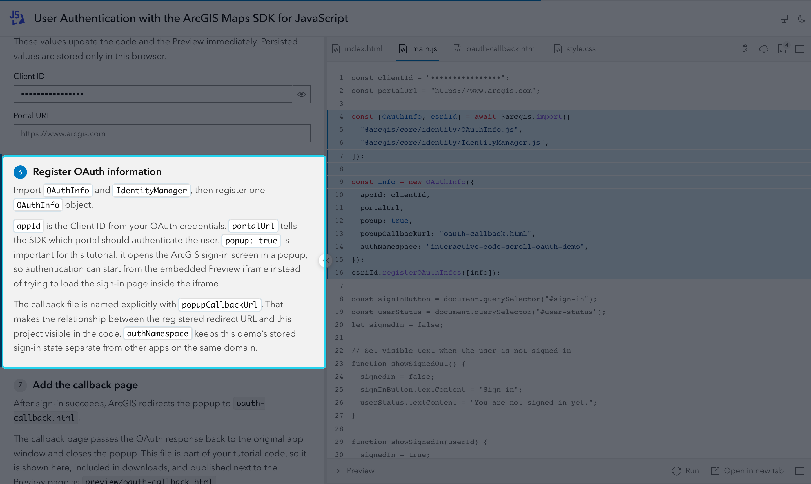
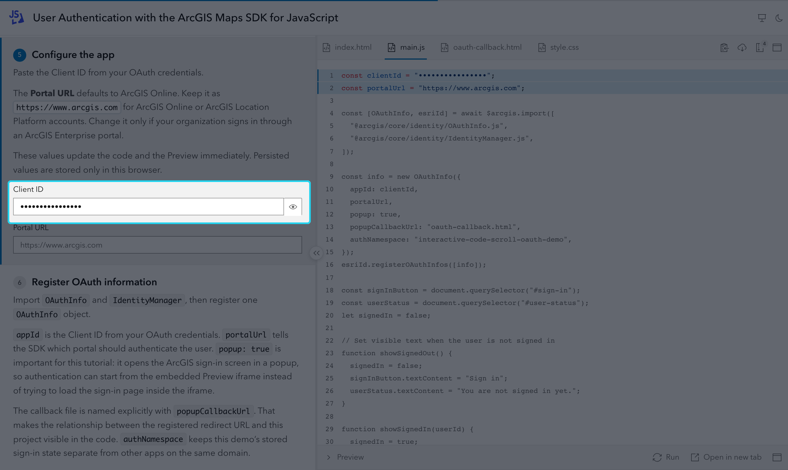
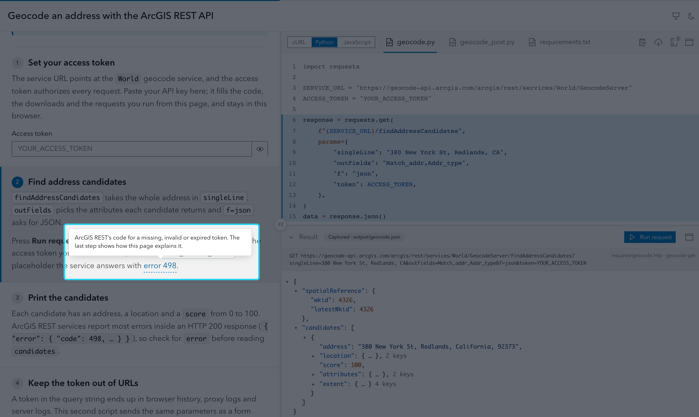
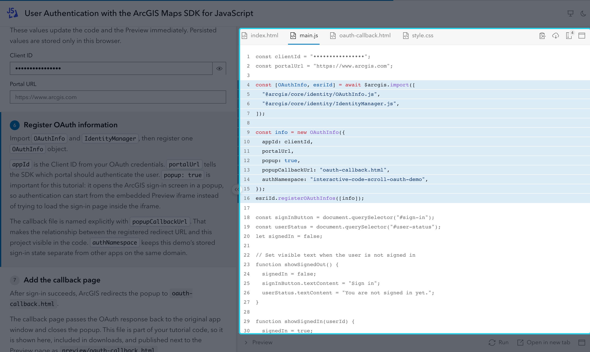
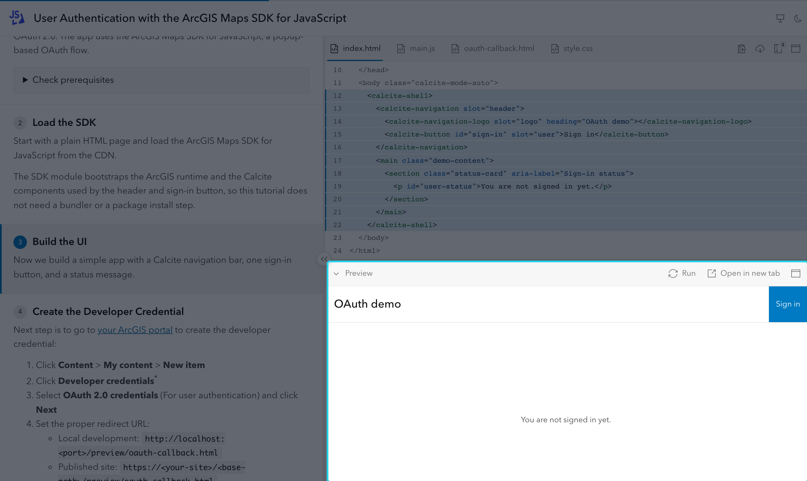
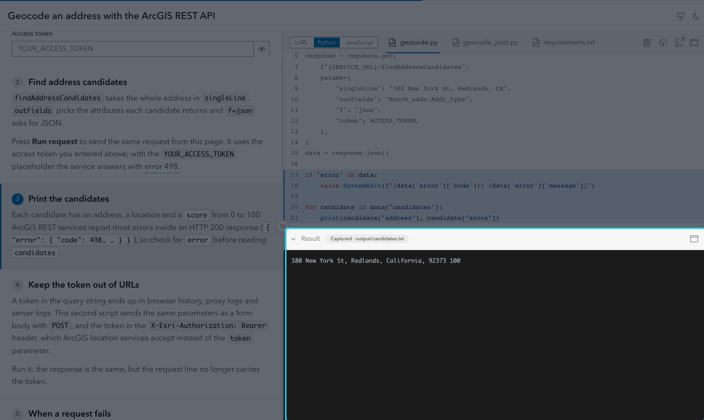

# Authoring Reference

Everything you write to build a tutorial: the files, the frontmatter, the MDX components and the markers in your code. New here? Start with the [Quick start](quick-start.md), then read [How a tutorial works](#how-a-tutorial-works) below; the rest of the page is reference you can jump into from the table of contents.

Two complete examples live in the repository: [examples/oauth-pkce](../examples/oauth-pkce) (a web app with a live Preview) and [examples/rest-geocode](../examples/rest-geocode) (REST calls in cURL, Python and JavaScript with a Result pane). `npm create interactive-code-scroll@latest` writes a working starting point for every setup on this page ([Create a Project](cli.md#create-a-project)).

## How a tutorial works

A tutorial is two things side by side: explanations you write in MDX, and a real, runnable project. Each explanation block is a **step**. A step points at a **region** of a code file, and as the reader scrolls, the code panel shows that file and highlights the region.

<picture>
  <source media="(prefers-color-scheme: dark)" srcset="../site/public/screenshots/reading-oauth-dark.png">
  
</picture>

The smallest tutorial is one MDX file with one step, and one code file with one region. Start with the explanation:

```mdx title="tutorial/tutorial.mdx"
---
title: Hello, page
---

<Step id="heading" file="index.html" region="heading">

## Add a heading

The `<h1>` is the first thing readers see.

</Step>
```

The step points at `index.html` and at its `heading` region, which the code file marks with two comments:

```html title="tutorial/code/index.html"
<!doctype html>
<html lang="en">
  <body>
    <!-- #region heading -->
    <h1>Hello</h1>
    <!-- #endregion heading -->
  </body>
</html>
```

That is all. When the reader reaches the step:

1. **The code panel follows the step.** It shows `code/index.html` and highlights the lines between `#region heading` and `#endregion heading`. The markers are comments, so the file stays valid HTML and never shows them to the reader. See [`<Step>`](#step) and [Regions](#regions).
2. **The Preview runs the code.** Because `code/` has an `index.html`, the tutorial is web code: the page runs it in a live [Preview](#preview) under the code panel. No setting is needed; the [`preview`](#frontmatter) field only changes how it is shown. Code that cannot run in the browser (a script, a REST call, a native app) shows its result in the [Result pane](#result-pane) instead.

From there, a tutorial grows with more steps and files, and with:

- **Editable values**: mark a string with `@var` and add a [`<VarField>`](#varfield); what the reader types replaces it in the code, the Preview and the downloads ([Variables](#variables)).
- **Images** instead of code for a step, such as setup screenshots ([Step examples](#step-examples)).
- **Results and requests** for code that runs outside the browser ([Result Pane](#result-pane), [HTTP Requests](#http-requests)).
- **Several languages** for the same steps ([Code Variants](#code-variants)).

Terms used on this page:

- **Web code**: a tutorial, or a [code variant](#code-variants), whose folder has an `index.html`. It gets the Preview; anything else gets the Result pane.
- **Text-only step**: a step with no `file`, `region` or `images`. It keeps the file on screen and clears the highlight.
- **Captured output**: a file under `output/` with the result the code produces (JSON, terminal text or an image), shown instead of running it.
- **Code variant**: the same steps in another programming language, picked with a switcher in the code header.

## Choose your setup

| You are teaching | Use | Read |
|---|---|---|
| A web app (HTML/JS, a browser SDK) | `code/index.html`; the Preview runs it | [Preview](#preview) |
| A script, a CLI or a native app | Captured results in `output/`, shown with `output=` | [Result Pane](#result-pane) |
| A REST API | `.http` files in `requests/`; readers press **Run request** | [HTTP Requests](#http-requests) |
| The same steps in several languages (cURL, Python, Node.js…) | Code variants: one folder per language under `code/` | [Code Variants](#code-variants) |
| Several languages with different explanations | One tutorial per language, linked as siblings | [Sibling tutorials](#sibling-tutorials) |
| Several tutorials on one site | A `tutorials/` folder with an index page | [Series Sites](#series-sites) |

The setups combine: a REST tutorial can have variants, captured outputs and requests at the same time, like [examples/rest-geocode](../examples/rest-geocode).

## Folder Structure

You do not need to create these folders by hand: `npm create interactive-code-scroll@latest` asks what you are teaching (web app, REST API, script or native app, in one or several languages), then writes the folders, a working example tutorial and the scripts to run it. See [Create a Project](cli.md#create-a-project).

The result is a folder with this shape:

```text
tutorial/
  tutorial.mdx
  code/
    index.html
    main.js
    style.css
  images/
    logo.svg
    screenshot.png
  output/            # optional: captured results for the Result pane
    geocode.json
  requests/          # optional: .http requests, zipped with the project
    geocode.http
```

- `tutorial.mdx` contains [frontmatter](#frontmatter), prose and [MDX components](#components).
- `code/` contains the final runnable project files, with [code markers](#code-markers) in comments. Large projects can keep everything here (Gradle wrappers, asset catalogs, binaries) and pick the files that get tabs with the [`files`](#files-not-shown-in-tabs) frontmatter.
- `images/` contains the logo, screenshots and carousel images referenced by [steps](#step).
- `output/` (optional) contains captured results of code that cannot run in the browser, shown by steps with `output=` in the [Result pane](#result-pane).
- `requests/` (optional) contains [HTTP requests](#http-requests) (`.http` files) bound by steps with `request=`, plus supporting files; it is added to every ZIP.

The source code should be valid without InteractiveCodeScroll: every marker is a comment ([Code Markers](#code-markers)). Several tutorials in one repository use a `tutorials/` folder instead ([Series Sites](#series-sites)).

## Frontmatter

The YAML block at the top of `tutorial.mdx`. Only `title` is required; every other field has a default. The fields fall into three groups:

- [**Page**](#page): what the tutorial page shows around the steps.
- [**Code and Preview**](#code-and-preview): which files the code panel shows, how they are highlighted, and how web code runs.
- [**Series index and siblings**](#series-index-and-siblings): metadata that only a [series site](#series-sites) uses, for the index cards and the language menu.

```yaml title="tutorial/tutorial.mdx"
---
# Page
title: Build a checkout page
description: Accept a payment with a hosted checkout form.
theme: auto
logo: logo.svg
# Code and Preview
preview: both
codeWrap: false
# Series index and siblings
tags: [JavaScript, Payments]
level: Beginner
duration: 15 min
order: 1
---
```

### Page

| Field | Values | Default | Description |
|---|---|---|---|
| `title` | string | required | Rendered in the app header. Do not repeat it as an MDX `#` heading. |
| [`description`](#index-page) | string | none | One sentence: the page's meta description (search results, link previews) and, in a [series site](#series-sites), the index card text. |
| `theme` | `auto`, `light`, `dark` | `auto` | Author default. Viewer changes are remembered. |
| [`logo`](#folder-structure) | image path or `https://` URL | none | Relative to `images/`, or an absolute `https://` URL (not checked at build, and it needs the network when serving locally). Use a square SVG or a PNG of at least 512 x 512. |

### Code and Preview

| Field | Values | Default | Description |
|---|---|---|---|
| [`files`](#files-not-shown-in-tabs) | list of paths/globs | all text files | Which `code/` files get tabs, in this order (`*` and `?` stay in one folder, `**` crosses folders). Other files still reach the ZIP and `preview/`; the ZIP button shows how many files the download contains, and its tooltip says how many are not shown in tabs. |
| `codeWrap` | boolean | `false` | Wraps long code lines when `true`; preserves horizontal scrolling when `false`. |
| [`languages`](#syntax-highlighting) | map | none | Extension (no dot) → Shiki language id or `text`, e.g. `languages: { qmd: markdown }`. Overrides the built-in highlighting for that extension. |
| [`preview`](#preview) | `off`, `iframe`, `tab`, `both` | `both` | Controls the Preview panel and the open-in-tab button. |
| [`variants`](#code-variants) | list | none | Code variants: the same steps in several languages. |
| [`otherVariantSteps`](#steps-across-variants) | `notice`, `hide` | `notice` | How steps limited with `only=` look to readers of another variant. |

### Series index and siblings

Ignored in a single-tutorial site, except `description`, which is also the page's meta description.

| Field | Values | Default | Description |
|---|---|---|---|
| [`tags`](#index-page) | list of strings | none | Series index card tags and filter values, e.g. `[REST, Python]`. No commas inside a tag. |
| [`level`](#index-page) | string | none | Series index card, e.g. `Beginner`; `<TutorialList level>` matches it exactly. |
| [`duration`](#index-page) | string | none | Series index card, e.g. `20 min`. |
| [`order`](#index-page) | number | none | Series index position: lower first; tutorials without it come after, by title. Also orders the [sibling](#sibling-tutorials) switcher. |
| [`family`](#sibling-tutorials) | string | none | Links sibling tutorials of a series site. Needs `familyLabel`. |
| [`familyLabel`](#sibling-tutorials) | string | none | This tutorial's name in the sibling menu, e.g. `Python`. Unique within the family. |

### Syntax highlighting

Highlighting happens at build time and is chosen by file extension. Other files show as plain text; the `languages` field maps any extension to a language.

| Languages | Extensions |
|---|---|
| Web | `js`, `mjs`, `cjs`, `jsx`, `ts`, `tsx`, `vue`, `html`, `css` |
| Data and config | `json`, `geojson`, `yaml`, `yml`, `toml`, `ini`, `xml`, `xaml`, `sql` |
| Docs and requests | `md`, `mdx`, `http` |
| Shell | `sh`, `bash`, `ps1` |
| Other languages | `py`, `kt`, `kts`, `gradle`, `swift`, `java`, `cs`, `cpp`, `h`, `hpp`, `qml`, `dart`, `lua` |

## Components

<picture>
  <source media="(prefers-color-scheme: dark)" srcset="../site/public/screenshots/area-explanations-dark.png">
  
</picture>

Components render the explanations panel on the left: the tags you write in MDX.

| Component | Where | What it does |
|---|---|---|
| [`<Intro>`](#intro) | `tutorial.mdx` | Content before the first step: not numbered, no code focus. |
| [`<Step>`](#step) | `tutorial.mdx` | One step: its explanation and what the code panel shows. |
| [`<VarField>`](#varfield) | `tutorial.mdx`, inside a step | A form field that edits a value in the code. |
| [`<Hint>`](#hint) | `tutorial.mdx`, inline | A short popover for a side note. |
| [`<TutorialList>`](#index-page) | `tutorials/index.mdx` | A section of tutorial cards on a series index. |
| [`<TutorialFilter>`](#index-page) | `tutorials/index.mdx` | The tag filter of a series index. |

Build errors name the file, line and column: `tutorial/tutorial.mdx:12:1 <Step> region "config" not found in code/main.js`. See [Validation](#validation) for the common ones.

### `<Intro>`

<picture>
  <source media="(prefers-color-scheme: dark)" srcset="../site/public/screenshots/area-intro-dark.png">
  
</picture>

Optional content before the first step. It is not numbered, does not count as a step and does not activate code focus.

```mdx title="tutorial/tutorial.mdx"
<Intro>

## Before you start

Install the prerequisites and keep this page open.

</Intro>
```

### `<Step>`

<picture>
  <source media="(prefers-color-scheme: dark)" srcset="../site/public/screenshots/area-step-dark.png">
  
</picture>

The main tutorial block: a heading, the explanation, and what the code panel and the pane under it show while the step is active.

```mdx title="tutorial/tutorial.mdx"
<Step id="configure" file="main.js" region="config" preview="collapsed">

## Configure the app

Explain the change here.

</Step>
```

| Prop | Values | Default | Description |
|---|---|---|---|
| `id` | lowercase letters, digits, `-` | required | Unique per tutorial. The step's URL is `#id` ([deep links](presenting.md#before-the-talk)). |
| [`file`](#folder-structure) | path | current file | File to show, relative to `code/` (to the variant folder with `variants`). |
| [`region`](#regions) | region id | none: no highlight | Region to highlight in `file`. With `variants`, `region` alone is enough: it names one file per variant. |
| [`images`](#show-images-instead-of-code) | `{["a.png", "b.png"]}` | none | Images in `images/` shown as a carousel instead of code. Must be a static array. |
| [`output`](#result-pane) | file name in `output/` | none | Captured result shown in the Result pane, e.g. `output="geocode.json"`. |
| [`request`](#http-requests) | request names | none | Space-separated `# @name`s from `requests/`, e.g. `request="geocode-get geocode-post"`; the first is the default. |
| [`preview`](#preview) | `expanded`, `collapsed`, `keep` | `keep` | Expands or collapses the Preview (or the Result pane) when the step activates. |
| [`maximize`](#maximize-from-a-step) | `code`, `preview`, `none` | keeps the current state | Maximizes the code area (code or images) or the pane under it (Preview or Result pane); `none` restores the layout. |
| [`only`](#steps-across-variants) | variant ids | all variants | With `variants`: space-separated ids the step applies to, e.g. `only="python curl"`. |

A [text-only step](#how-a-tutorial-works) keeps the current file visible and clears any previous region focus.

#### Step examples

##### Highlight a code block

```mdx title="tutorial/tutorial.mdx"
<Step id="config" file="main.js" region="config">
```

Without `region`, the whole file shows with no highlight. Without `file`, the step keeps the file on screen.

##### Show images instead of code

```mdx title="tutorial/tutorial.mdx"
<Step id="register-app" images={["1-create-item.png", "2-copy-client-id.png"]}>
```

Paths are relative to `images/`. Step keys page through the images before moving to the next step; clicking one opens a full-screen viewer. The value must be a JSX array written in place (`images={[…]}`), not a string or a variable.

##### Show a saved result

```mdx title="tutorial/tutorial.mdx"
<Step id="results" region="results" output="candidates.txt">
```

The file lives in `output/` (or `output/<variant id>/` for one language). See [Result Pane](#result-pane).

##### Let readers run a request

```mdx title="tutorial/tutorial.mdx"
<Step id="request" region="request" output="geocode.json" request="geocode-get">
```

Adds a **Run request** button that sends `# @name geocode-get` from `requests/`. The captured `output` is shown until the reader runs it, and again if the network fails. See [HTTP Requests](#http-requests).

##### Make a result fill the screen

```mdx title="tutorial/tutorial.mdx"
<Step id="run-it" output="geocode.json" maximize="preview">…</Step>
<Step id="back" maximize="none">…</Step>
```

See [Maximize from a step](#maximize-from-a-step).

##### Apply a step to some languages only

```mdx title="tutorial/tutorial.mdx"
<Step id="install" file="requirements.txt" only="python">
```

See [Steps across variants](#steps-across-variants).

### `<VarField>`

<picture>
  <source media="(prefers-color-scheme: dark)" srcset="../site/public/screenshots/area-varfield-dark.png">
  
</picture>

A form field linked to an [`@var` marker](#variables) in code. What the reader types replaces the marked literal in the code panel, the Preview, the ZIP and the [requests](#request-runner); an empty field restores the literal, which is the default value.

```mdx title="tutorial/tutorial.mdx"
<VarField name="clientId" label="Client ID" secret persist />
<VarField name="portalUrl" label="Portal URL" placeholder="https://example.com" persist />
```

| Prop | Values | Default | Description |
|---|---|---|---|
| [`name`](#variables) | variable name | required | An `@var` name in a code file, or a file variable in a [`.http` file](#http-file-variables). |
| `label` | string | required | Visible field label. |
| `placeholder` | string | none | Input hint. Does not change the code default. |
| `secret` | flag | off | Masks the input, the value in the code and the [request line](#request-runner) until the reader reveals it. |
| `persist` | flag, or `"tutorial"` | off | Stores the value in `localStorage`. `persist` shares it with every tutorial of a [series site](#series-sites) (a key is entered once per site); `persist="tutorial"` keeps it to this tutorial. On a single-tutorial site both behave the same. |

### `<Hint>`

<picture>
  <source media="(prefers-color-scheme: dark)" srcset="../site/public/screenshots/area-hint-dark.png">
  
</picture>

A short inline clarification with a hover/focus popover.

```mdx title="tutorial/tutorial.mdx"
The Preview runs from a <Hint id="same-origin" label="same-origin page">A real URL under the generated site.</Hint>.
```

| Prop | Values | Default | Description |
|---|---|---|---|
| `id` | lowercase letters, digits, `-` | required | Unique per tutorial. |
| `label` | string | required | The underlined text in the sentence. |

The content between the tags is the popover. Use hints for brief side notes; use regular prose or `<details>` for essential or longer content.

## Code Markers

<picture>
  <source media="(prefers-color-scheme: dark)" srcset="../site/public/screenshots/area-code-dark.png">
  
</picture>

The code panel on the right shows your files. Markers are comments in those files that tell it what to highlight and what readers can edit; they never reach the reader or the downloads.

### Regions

Wrap the lines a step highlights in `#region <id>` and `#endregion <id>` comments:

```js title="tutorial/code/main.js"
// #region config
const title = "Checkout";
// #endregion config
```

Use the comment syntax of the file:

```html title="tutorial/code/index.html"
<!-- #region app -->
<main id="app"></main>
<!-- #endregion app -->
```

```css title="tutorial/code/style.css"
/* #region layout */
main {
  display: grid;
}
/* #endregion layout */
```

```sh title="tutorial/code/setup.sh"
# #region setup
npm init -y
npm install -D astro interactive-code-scroll
# #endregion setup
```

```yaml title="tutorial/code/config.yaml"
# #region frontmatter
title: My Tutorial
preview: tab
# #endregion frontmatter
```

A few languages also accept their own region style. Each one works only in its own file type, so the same text in any other file stays an ordinary comment:

| Files | Style |
|---|---|
| `.cs` | C# `#region id` / `#endregion` |
| `.py` | `# region id` / `# endregion` (VS Code folding style) |
| `.sql`, `.lua` | `-- #region id` / `-- #endregion` |

```python title="tutorial/code/geocode.py"
# region geocode
response = requests.get(url, params=params)
# endregion geocode
```

Rules:

- Region ids are unique per file.
- Regions may nest.
- Empty regions are errors.
- A closing id, when present, must match the opened region.

### Variables

Put `@var <name>` in a comment on the same line as a string literal. The literal is the default value; a [`<VarField>`](#varfield) with the same `name` lets readers change it.

```js title="tutorial/code/main.js"
const tutorialTitle = "InteractiveCodeScroll"; // @var tutorialTitle
```

Rules:

- `@var` targets the first string literal on its line.
- Use one `@var` per line.
- Variable names are unique per file.
- The same variable may appear in several files (for example a token in `main.py` and `MainActivity.kt`); one form field then fills all of them. Every occurrence must use the same default literal, or the build fails and lists each file.
- SQL and Lua files also accept `-- @var name` comments.

Values are escaped for the file type and quote style, so whatever the reader types keeps the code valid:

| Files | Escaping |
|---|---|
| JS/TS, JSON, CSS, Python, Swift, Java, C#, C++, QML, YAML/TOML double quotes | Backslash escapes (`\"`, `\\`, `\n`) |
| Kotlin, Dart, Gradle/Groovy | Backslash escapes plus `\$`, so values never start a string template |
| Shell (`.sh`, `.bash`) | Double quotes escape `\ " $` and backticks; single quotes use `'\''` |
| PowerShell (`.ps1`) | Double quotes use backtick escapes; single quotes double the quote |
| SQL, YAML single quotes | The quote is doubled (`''`) |
| HTML/XML/XAML (`<!-- @var -->`) | Attribute entities (`&quot;`, `&amp;`, `&lt;`) |

Literals that cannot hold an arbitrary value are build errors: Python f-strings, raw strings and triple-quoted strings, and TOML literal strings (`'...'`). Use a plain string instead.

### `.http` file variables

In `.http` files (VS Code REST Client / JetBrains HTTP Client syntax), every file variable line is a variable with the rest of the line as its default. No `@var` marker is needed. This applies to `.http` files in `code/` and in [`requests/`](#http-requests); a `<VarField>` can target either, and a var used in both needs the same default:

```http title="tutorial/requests/search.http"
@accessToken = YOUR_ACCESS_TOKEN

GET https://example.com/search?token={{accessToken}}
```

Values are inserted as typed, with line breaks removed.

## Preview

<picture>
  <source media="(prefers-color-scheme: dark)" srcset="../site/public/screenshots/area-preview-dark.png">
  
</picture>

Web code runs in a live Preview under the code panel. It needs `code/index.html` (with code variants, see [Preview and downloads](#preview-and-downloads)). The generated site publishes every file under `code/` next to the Preview page, with markers stripped, so relative links such as `./main.js` or `./oauth-callback.html` keep working.

The [`preview`](#frontmatter) frontmatter field picks the mode:

| Value | Reader gets |
|---|---|
| `both` (default) | The embedded Preview and an open-in-tab button |
| `iframe` | The embedded Preview only |
| `tab` | The open-in-tab button only |
| `off` | No Preview; `code/index.html` is not required |

Form changes refresh the Preview after a short debounce; the Run button refreshes it manually. A step's [`preview`](#step) prop expands or collapses it.

### Maximize from a step

Readers can maximize the code panel, the iframe Preview or the Result pane from their headers (see [Maximized panes](presenting.md#maximized-panes)). A step can do it for a talk, for example to show a big result and restore the layout on the next step:

```mdx title="tutorial/tutorial.mdx"
<Step id="run-it" maximize="preview">…</Step>
<Step id="back" maximize="none">…</Step>
```

Build errors: `maximize="preview"` together with `preview="collapsed"`, and `maximize="preview"` in a tutorial with no pane to maximize (`preview: off` or `tab` and no step with `output=` or `request=`).

To show a tutorial in a talk or workshop (presentation mode, clickers, zoom, offline fallback), see [Presenting a Tutorial](presenting.md).

## Result Pane

<picture>
  <source media="(prefers-color-scheme: dark)" srcset="../site/public/screenshots/area-result-dark.png">
  
</picture>

Code that cannot run in the browser (scripts, native apps, [HTTP requests](#http-requests)) shows its result in the Result pane, which takes the Preview's place under the code. A tutorial without variants is web code when `code/` has `index.html`; with variants, each variant with `index.html` shows the Preview and every other variant shows the Result pane. The pane appears only when some step has `output=` or `request=`.

```mdx title="tutorial/tutorial.mdx"
<Step id="request" region="request" output="geocode.json">

## Send the request

</Step>
```

- **Where outputs live**: `output="name"` looks up `output/<variant id>/name` first (a per-variant override), then `output/name`. It must resolve for every non-web variant the step covers.
- **File types**:
  - `.json`: a collapsible, colored tree (large ids keep their exact digits; a file that does not parse shows as text).
  - `.txt`, `.log`: terminal style. Prompt lines such as `$ cmd`, `> cmd`, `>>> cmd` or `PS C:\> cmd` are colored and ANSI color codes become colors.
  - `.png`, `.jpg`, `.jpeg`, `.gif`, `.webp`, `.svg`: an image.
  - Any other type is a build error.
- **Steps without a result** keep showing the result of the nearest earlier step that has one for the active variant, whether the reader scrolled, used step keys or opened a deep link. Before the first output the pane shows an empty state.
- **Published, not embedded**: outputs are published under `output/` and fetched when shown, so the page stays small and works offline. They are rendered as text or images, never as HTML. `output/` is not part of the ZIP.
- **Credentials**: outputs are committed and published. The build warns (without failing) when one looks like it holds a credential: `token=`, `"token":`, `apiKey` or `Authorization: Bearer` followed by a value that is not a var default. Replace real values with the var's default (the demo value in the code) before publishing.
- `output=` in web code is a build error: web code shows the Preview.

What readers can do in the pane (keyboard navigation of the JSON tree, collapsing, maximizing) is listed in [Features](features.md#result-pane).

## HTTP Requests

Requests live in `.http` files under `requests/` (VS Code REST Client / JetBrains HTTP Client syntax), so they stay runnable in those tools. They are not code tabs or variants: they are the source of the Result pane's [request runner](#request-runner) and are included in every ZIP as `requests/`, with form values applied. A `.http` file under `code/` is an ordinary code file and is never run.

```http title="tutorial/requests/geocode.http"
@serviceUrl = https://geocode-api.arcgis.com/arcgis/rest/services/World/GeocodeServer
@accessToken = YOUR_ACCESS_TOKEN

# @name geocode-get
GET {{serviceUrl}}/findAddressCandidates
  ?singleLine=380 New York St, Redlands
  &f=json
  &token={{accessToken}}

###

# @name geocode-post
POST {{serviceUrl}}/findAddressCandidates
Content-Type: application/x-www-form-urlencoded
X-Esri-Authorization: Bearer {{accessToken}}

singleLine=380 New York St, Redlands&f=json
```

```mdx title="tutorial/tutorial.mdx"
<Step id="geocode" region="geocode" request="geocode-get geocode-post">
```

Supported syntax:

- `###` separates requests.
- `# @name x` or `// @name x` names the next request (letters, digits, `_` and `-`). Unnamed requests are allowed but cannot be bound by `request=`.
- File variables `@x = value` anywhere in the file; `{{x}}` uses them within the same file.
- A request line `METHOD URL` (optional `HTTP/x` suffix) with `GET`, `POST`, `PUT`, `PATCH`, `DELETE`, `HEAD` or `OPTIONS`, optionally continued by lines starting with `?` or `&`; then headers (`Name: value`), a blank line and the body.
- Comments (`#`, `//`) outside the body.

Not supported (build errors):

- Request variables (`{{name.response…}}`) and system variables (`{{$guid}}`…).
- `< file` bodies, and pre-request or response handler scripts (`< `, `> `, `>> file`).
- `{{x}}` with no file variable `x`, and a request line without a supported method.
- A request name defined twice across `requests/`, or a `request=` name that does not exist or is listed twice.
- `request=` on a step whose variants are all web code (or in a tutorial with `code/index.html`).
- Binary files in `requests/`, and a `code/requests/` (or `code/<variant dir>/requests/`) folder that would overwrite `requests/` in the ZIP.

Other text files in `requests/` (for example a README) are zipped as is. `requests/errors.json` is the [error rule](#service-errors).

### Request runner

A [step](#step) with `request=` gets a **Run request** button in the Result pane. Nothing is sent until the reader presses it: activating a step never sends a request. [examples/rest-geocode](../examples/rest-geocode) is a complete example: a GET step (token in the query) and a POST step (token in a header), each running the request its code shows.

What to know as an author:

- **Run as**: when a step lists several requests, a picker labeled with each request's method (or its name when two share a method) chooses which one to send. The first is the default each time the step is shown. Offer an alternative only when the step's code shows it too: readers expect Run to send what they read.
- **Values**: every `{{x}}` takes the reader's [`<VarField>`](#varfield) value, else the file variable's default; file variables may use other file variables. Values substituted in the query string (after `?`) are URL-encoded; in the path, headers and body they are inserted as is.
- **Secrets**: the request line above the result shows the method and URL; values of `secret` vars are masked unless the reader presses **Show secrets**, which is off on every page load. Headers and body are not shown.
- **Failures**: a request is aborted after 30 s. On a timeout or a network/CORS failure the pane says so and shows the step's captured `output` instead, so give request steps one. A request the browser cannot build (an invalid URL, a body on `GET`/`HEAD`) is reported and not sent.
- **CORS**: requests are sent with `fetch` from the reader's browser without cookies, so the service must allow cross-origin requests; browsers drop headers they forbid (such as `Host` or `Cookie`).
- **Service errors**: errors reported inside a successful response need an [error rule](#service-errors).

What readers see (status badge, Body and Headers tabs, **Keep response**, **Show captured**) is described in [Features](features.md#result-pane).

### Service errors

Some APIs report errors inside a successful response: ArcGIS REST, for example, answers HTTP 200 with `{ "error": { "code": 498, "message": "Invalid token." } }`. Declare how to recognize them in `requests/errors.json`:

```json title="tutorial/requests/errors.json"
{
  "object": "error",
  "code": "error.code",
  "message": "error.message",
  "help": {
    "498": { "text": "The token is expired, revoked or mistyped.", "link": "https://…/error-codes#498" }
  },
  "fallbackLink": "https://…/error-codes"
}
```

- `object`, `code` and `message` (required) are dot paths from the root of the response body. A JSON body where `object` is an object is a service error, whatever the HTTP status.
- `help` (optional) maps codes to a short `text` and a `link`; `fallbackLink` (optional) is shown for codes without help. Links must be `http(s)` URLs.
- The pane shows the failure prominently: a red badge (`Error 498 · HTTP 200`), a notice with the code, the message, the help text and its link, and the body below it.
- The build validates the file (valid JSON, required paths, help entries, URLs, unknown keys) and reports errors as `requests/errors.json:<line>`. It is not a request file and is zipped with `requests/`.

## Files Not Shown in Tabs

- Binary files (images, fonts, jars, archives, anything with a NUL byte) never get a tab. They are published under `preview/` and added to the ZIP byte for byte.
- With [`files`](#frontmatter) set, text files that match no pattern are also left out of the code panel and the page, and still go into the ZIP.
- Files not shown in tabs cannot contain [`@var`](#variables) markers, and a [`<Step file>`](#step) must point at a file shown in a tab.
- `index.html` is always available to the Preview, whether or not it is shown in a tab.

## Code Variants

Variants show the same tutorial in several programming languages, for example a REST call as cURL, Python and Node.js. The prose and the steps are shared; only the code changes. When the explanations themselves differ by language, write [sibling tutorials](#sibling-tutorials) instead.

### Folder structure

Each variant lives in its own folder under `code/`. With `variants`, every code file must belong to a variant folder.

```text
tutorial/
  tutorial.mdx
  code/
    python/
      request.py
      requirements.txt
    curl/
      request.sh
    node/
      index.mjs
      api.mjs
```

```yaml title="tutorial/tutorial.mdx"
---
title: Call the items API
variants:
  - { id: python, label: Python, dir: python, entry: request.py, files: ["request.py", "requirements.txt"] }
  - { id: curl, label: cURL, dir: curl, entry: request.sh }
  - { id: node, label: Node.js, dir: node, entry: index.mjs }
---
```

| Key | Values | Default | Description |
|---|---|---|---|
| `id` | lowercase letters, digits, `-` | required | Used in `?variant=` links and `only=`. |
| `label` | string | required | Shown in the language switcher. |
| `dir` | folder | required | Relative to `code/`. Folders must not overlap. |
| `entry` | file | required | File shown first, relative to `dir`. |
| `files` | list of paths/globs | all text files | Like the top-level [`files`](#frontmatter), relative to `dir`. The top-level `files` cannot be combined with `variants`. |

### Steps across variants

[Region](#regions) ids are the contract between variants. Give the same region the same id in every variant, in whichever file it lives:

```mdx title="tutorial/tutorial.mdx"
<Step id="request" region="request">

## Send the request

</Step>
```

- Within a variant, a region id may appear in only one file, so `region` alone identifies the file.
- `file` is relative to the variant folder and must exist in every variant the step covers.
- Every step region must exist in every variant, unless the step sets `only`:

```mdx title="tutorial/tutorial.mdx"
<Step id="install" file="requirements.txt" only="python">

## Install dependencies

</Step>
```

`otherVariantSteps` decides what readers of other variants see for such a step:

- `notice` (default): the step stays in place and keeps its number; the code panel keeps its file, clears the focus and shows "This step applies to Python" with an action to switch.
- `hide`: the step disappears from the explanations; numbering and progress count only the steps of the active variant. A `#step` link to a hidden step switches to that step's variant.

### Reader experience

- The language switcher sits at the start of the code header: a segmented control for up to four variants whose file tabs fit next to it, a dropdown otherwise. This is automatic.
- Switching keeps the current step and focuses the same region in the new variant's file. A text-only step keeps the file with the same path when the new variant has it, else shows the new variant's `entry`.
- The choice is remembered for the whole site and can be linked: `?variant=curl#request`. An unknown id is ignored.
- Form fields are shared: one [`@var`](#variables) name fills every variant, and all its occurrences need the same default literal.

### Preview and downloads

- A variant is web code when its folder has `index.html`. Only web variants show the Preview; other variants show the [Result pane](#result-pane) instead when the tutorial has captured outputs. `preview` in the frontmatter applies to the web variants, and a tutorial without any web variant needs no `index.html`.
- A web variant's Preview runs from its own page, `preview/<dir>/index.html`, with every file of the variant published next to it, so relative references such as `./main.js` or an OAuth callback page resolve inside the variant folder.
- The ZIP holds only the active variant: its folder becomes the root of the archive, named `<tutorial>-<variant id>.zip`, plus `requests/` when the tutorial has it. The ZIP badge and tooltip count those files.

## Series Sites

A repository can publish several tutorials as one site. Put each tutorial folder (the [structure above](#folder-structure)) under a series folder:

```text
tutorials/
  display-map/       # published at /display-map/
    tutorial.mdx
    code/
  geocode/           # published at /geocode/
    tutorial.mdx
    code/
  _drafts/           # ignored: starts with "_"
```

The CLI detects this structure on its own: with no `tutorial/tutorial.mdx` and no root `tutorial.mdx`, but at least one `tutorials/<name>/tutorial.mdx`, `interactive-code-scroll dev` serves the whole series. For another folder name, pass `--tutorials <dir>`; `--tutorial tutorials/<name>` still serves one tutorial on its own. To publish the series on GitHub Pages, use the workflow in the [Deployment Guide](deployment.md#github-pages): the same file works for one tutorial or a series, and every tutorial URL keeps the Pages base path (`/<repo>/display-map/`). In your own `astro.config.mjs`:

```js title="astro.config.mjs"
interactiveCodeScroll({ tutorials: "tutorials" })
```

- The folder name is the tutorial's URL, so it must use lowercase letters, digits and `-` (build error otherwise).
- Folders starting with `_` or `.` are ignored; other folders without `tutorial.mdx` are skipped with a warning.
- Each tutorial's Preview, published code and captured outputs live under its own URL. Its header gets an "All tutorials" link back to the index.
- `tutorial` and `tutorials` cannot be combined.
- Persisted [`<VarField>`](#varfield) values are shared by every tutorial on the site (enter a key once); use `persist="tutorial"` for a value that belongs to one tutorial. A Preview never shows another tutorial's code.

### Index page

`/` lists every tutorial as a card: title, `description`, `level`, `duration` and `tags` from each tutorial's [frontmatter](#frontmatter), ordered by `order` (lower first; tutorials without it follow, by title). When any tutorial has tags, a tag filter shows only the cards with any of the selected tags.

To customize the index, add `tutorials/index.mdx`:

```mdx title="tutorials/index.mdx"
---
title: ArcGIS tutorials
description: Build apps with ArcGIS, from REST to native SDKs.
logo: logo.svg
theme: auto
---

Start with the REST tutorials if you are new to location services.

<TutorialFilter />

## Web apps

<TutorialList tags="JavaScript, Web" />

## Scripts

<TutorialList tags="Python" level="Beginner" />
```

| Field | Values | Default | Description |
|---|---|---|---|
| `title` | string | `Tutorials` | Header heading and page title. |
| `description` | string | none | Shown under the title in the header and as the page's meta description (clipped on narrow screens). |
| `logo` | image path or `https://` URL | none | Relative to `tutorials/images/` (that folder is never a tutorial), or an absolute `https://` URL. |
| `theme` | `auto`, `light`, `dark` | `auto` | Author default. Viewer changes are remembered site-wide. |

The body is free MDX prose with two components; anything else is a build error.

| Component | Props | Description |
|---|---|---|
| `<TutorialList>` | `tags="A, B"`, `level="Beginner"` | A section of cards. `tags` (comma-separated, since a tag may contain spaces) keeps tutorials with any of those tags; `level` keeps that exact level; both combine. Without props it lists every tutorial. A tag or level no tutorial uses fails the build. |
| `<TutorialFilter>` | none | The tag filter, where you place it. It filters every list on the page and counts tutorials once even when they appear in several sections. At most one per page; leave it out to show no filter. |

Without `index.mdx`, the index is the filter plus one list of every tutorial.

### Custom index page

For full control, replace the index with your own Astro page. Keep it outside `src/pages/` (Astro would also publish it as a route of its own). Pass it to the CLI:

```sh
interactive-code-scroll dev --index src/series-home.astro
```

or set it in your own `astro.config.mjs`:

```js title="astro.config.mjs"
interactiveCodeScroll({ tutorials: "tutorials", index: "src/series-home.astro" })
```

```astro title="src/series-home.astro"
---
import { tutorials, TutorialFilter, TutorialList } from "interactive-code-scroll/series";
---
<html lang="en">
  <head>
    <meta charset="utf-8" />
    <meta name="viewport" content="width=device-width, initial-scale=1" />
    <title>My tutorials</title>
  </head>
  <body>
    <h1>{tutorials.length} tutorials</h1>
    <ul>
      {tutorials.map((t) => <li><a href={t.href}>{t.title}</a> {t.level}</li>)}
    </ul>
    <TutorialFilter />
    <TutorialList tags="Python" />
  </body>
</html>
```

- `tutorials` lists every tutorial in index order: `slug`, `href` (includes Astro's `base`), `title`, `tags`, and `description`, `level`, `duration`, `order` when set.
- `<TutorialList>` and `<TutorialFilter>` work as in `index.mdx` and bring their own styles and filter script. The page owns everything else (layout, header, theme). Include `<meta charset="utf-8" />`: Astro does not add it, and without it non-ASCII text (such as `—` or accents) renders garbled.
- `index` must be an `.astro` file, needs `tutorials`, and cannot be combined with `tutorials/index.mdx` (build error: the file would be ignored).

### Sibling tutorials

When the explanations differ by language (for example the JavaScript SDK and the Python API), write one tutorial per language and link them with the same `family`. Use [code variants](#code-variants) instead when the steps and prose are shared.

```yaml
# tutorials/display-map-js/tutorial.mdx
family: display-map
familyLabel: JavaScript
```

```yaml
# tutorials/display-map-python/tutorial.mdx
family: display-map
familyLabel: Python
```

- The header shows a "Tutorial for: <familyLabel> ▾" menu after the title, with links to the family's tutorials by `order`, then `familyLabel`.
- Choosing a sibling opens it on the step with the same id when it exists (give matching steps the same `id`), else at its top. The reader's code variant carries over when the sibling has a variant with that id.
- Keep siblings and variants apart: a sibling's `familyLabel` should not repeat a language that is already a code variant of another sibling (for example a "REST API" tutorial with a Python variant next to a "Python" sibling), or readers see two "Python" choices that do different things.
- `family` and `familyLabel` go together, and each label must be unique within its family (build errors). A family with one tutorial, or `family` outside a series site, only warns.
- The index keeps one card per tutorial.

## Validation

The build checks every reference before it writes the site: a wrong file, region, variable, image, output, request or frontmatter value fails it. Every error names the file, line and column, and frontmatter errors point at the offending key. In dev mode, validation re-runs whenever `tutorial.mdx` or a file under `code/`, `images/`, `requests/` or `output/` changes, and the error appears in the browser overlay at the first failing line.

### Common build errors

Errors start with the location, for example `tutorial/tutorial.mdx:12:1 <Step> …` or `main.js:4: …`. The message is the part after it:

| Message | Fix |
|---|---|
| `<Step> file "x" not found in code/` | `file` is relative to `code/` (to the variant folder with variants). Check the path and extension. |
| `<Step> region "x" not found in code/main.js` | Add `#region x` / `#endregion x` to that file, or fix the id. |
| `<Step> region "x" requires a "file"` | Without variants, a region needs `file`. |
| `<Step> region "x" not found in variant "y" (code/y/); add it or set "only"` | Every variant needs the region, unless the step sets [`only`](#steps-across-variants). |
| `<Step> file "x" is not shown in tabs; add it to frontmatter "files"` | The file is left out by [`files`](#files-not-shown-in-tabs). |
| `<Step> "images" must be a static array of strings, e.g. images={["a.png"]}` | Write the array in place, in braces: `images={["a.png"]}`. |
| `<Step> image "x" not found in images/` | Paths are relative to `images/`. |
| `<Step> output "x" not found in output/` | Add the file to `output/` (or `output/<variant id>/`). |
| `<Step> output "x" has no effect: code/index.html makes the tutorial web code, which shows the Preview` | Web code has no Result pane: remove `output` or `index.html`. |
| `<Step> request "x" not found in requests/ (# @name x)` | Name the request with `# @name x` in a `.http` file under `requests/`. |
| `<Step> maximize="preview" has no pane to maximize: …` | Enable the iframe [Preview](#preview) or give some step a result. |
| `<Step> duplicate id "x"` | Step ids are unique per tutorial. |
| `<VarField> no "@var x" found in code/` | Add `// @var x` next to the literal in the code, or fix the name. |
| `@var "x" must have the same default in every file: …` | Use the same literal in every file that marks `x`. |
| `code/x: @var "y" is in a file not shown in tabs; …` | Show the file in tabs or remove the marker. |
| `@var x has no string literal on its line` | Put the marker on the line of a plain string literal. |
| `#region "x" is empty` · `unclosed #region "x"` · `#endregion "a" closes #region "b"` | Fix the [region markers](#regions) in that file. |
| `frontmatter logo "x" not found in images/ (or use an https:// URL)` | Put the logo in `images/` or use an `https://` URL. |
| `code/x: file is outside every variant folder; move it into one of …` | With variants, every code file belongs to a variant folder. |
