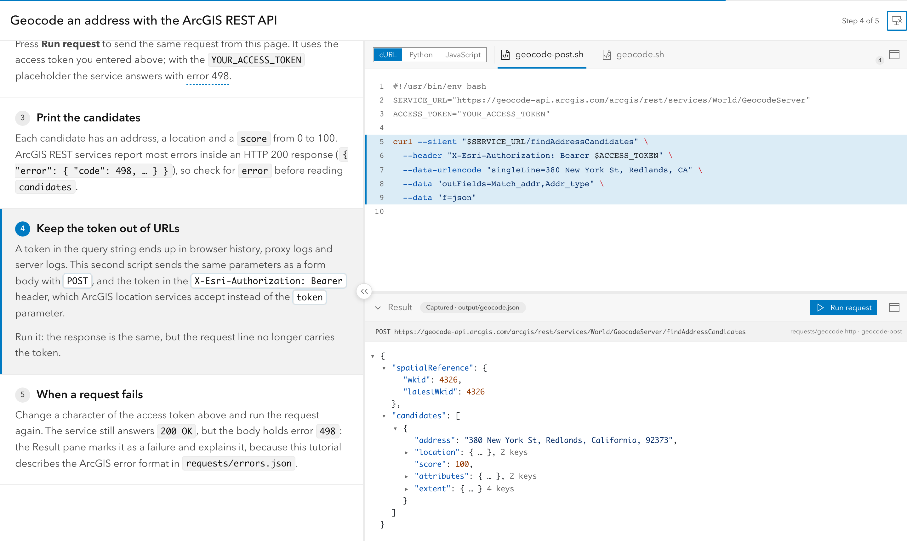

# Presenting a Tutorial

How to show a tutorial in a talk, a workshop or a screen share. For writing one, see [Authoring Reference](authoring.md).

<picture>
  <source media="(prefers-color-scheme: dark)" srcset="../site/public/screenshots/present-rest-curl-dark.png">
  
</picture>

## Before the talk

- **Link to the exact spot**: `#step-id` opens the tutorial at a step, and `?variant=curl#request` also picks the language. Keep one link per section of the talk.
- **Pick the theme for the room**: the header toggle switches light and dark, and the choice is remembered for the whole site. Light usually reads better on projectors.
- **Zoom until the back row can read the code** (CMD/Ctrl + "+"). The layout stays usable at high zoom: the Result pane header turns "Keep response", "Show captured" and then "Run request" into icons (their names show as tooltips), and a short Result pane scrolls as a whole: request line, notices and body. Long lines wrap when the author sets `codeWrap: true` ([Frontmatter](authoring.md#frontmatter)).
- **Plan for a bad network**: give request steps a captured `output=`. If the venue's network or CORS blocks a live request, the pane falls back to it and says so. Serve the site from your laptop with the CLI (`serve`, see [Commands](cli.md#commands)) when the network is unreliable.
- **Secrets on screen**: secret fields and the request line stay masked; "Show secrets" is off on every page load. Persisted fields keep what you typed in the browser, so present from a browser profile without your real credentials.

## During the talk

- **Presentation mode**: the header's presentation icon enters browser full screen with a compact toolbar. The handle on the explanations splitter hides the explanations so the code gets the full width. Esc leaves.
- **Clickers and keys**: PageDown/PageUp move steps wherever the focus is: a form field, the JSON tree, the Result pane's tabs and controls, or the Preview. Only multi-line text keeps them. Arrow keys also move steps, except inside fields and widgets that use them (JSON tree, Body/Headers tabs, "Run as", splitters).
- **Images**: on a step with images, step keys page through them before moving to the next step; clicking an image opens a full-screen viewer.
- **Splitters**: drag them to give the code or the Preview more room. Their sizes are remembered.

## Maximized panes

The code panel, the iframe Preview and the Result pane each have a maximize icon in their header. A maximized pane fills the browser window (the whole screen in presentation mode); its icon or Esc restores the layout with the same splitter sizes. One pane is maximized at a time, and step keys keep moving steps underneath. On a step with images, the maximized code area shows the carousel with a floating restore action. Maximizing a collapsed Preview or Result pane expands it; collapsing it restores the layout. The state is not remembered across reloads.

Authors can maximize a pane from a step, for example to show a big result and restore the layout on the next step: see [`maximize`](authoring.md#maximize-from-a-step).

## Leaving with Esc

Esc goes one level at a time: an open image viewer, then the maximized pane, then presentation mode. In browser full screen, the browser takes the first Esc to leave full screen (and presentation mode); the pane stays maximized until the next Esc.
